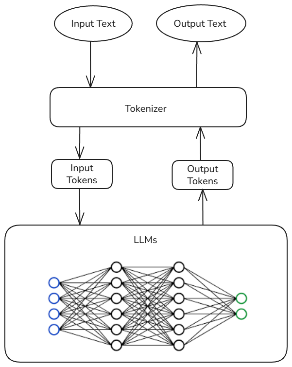
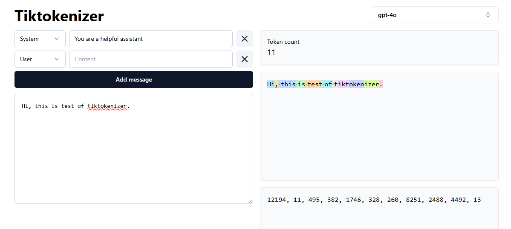
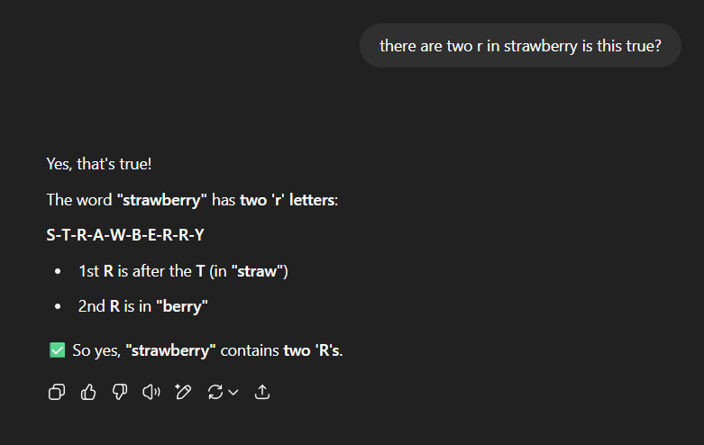
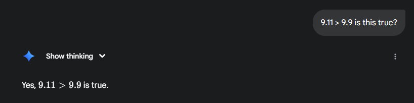

# tinybpe: a tiny byte pair encoder


### In This Article
- [What is Byte-Pair Encoder?](#what-is-byte-pair-encoder)
- [Why use BPE?](#why-use-BPE)
- [Example Walkthrough](#example-walkthrough)
- [A simple Python implementation](#a-simple-python-implementation)
- [The Good, the Bad, and the Evil of BPE](#the-good-the-bad-and-the-evil)
- [Thought Experiments](#thought-experiments)
- [Final Thoughts](#final-thoughts)
- [References](#references)

Note: This blog assumes a basic understanding of Python. For implementation details, refer to the [tinybpe repo.](https://github.com/iamaryav/tinybpe)  

---

### What is Byte-Pair Encoder?

This is an algorithm that compresses texts by using a table. This algorithm is used in LLMs (large language models) like the ChatGPT series, Llama, BART, RoBERTa, and other models with some modifications. OpenAI made it famous by using it in pretraining GPT series models.

It gives us the freedom to write in English or any human-readable language, and then BPE takes that language and converts it into tokens. In the same way, a model outputs only tokens, and a tokenizer decodes the tokens into the English language. We can see the tokenization flow in this diagram.    

  

In the image below, you can see a sentence and the tokens after conversion in the GPT-4o model. That is what a model sees when we ask them a question. If you want to play more with this, check out [tiktokenizer](https://tiktokenizer.vercel.app/) on how different models convert texts into tokens.  



---

### Why use BPE?

LLMs do not process text like humans do; they operate on sequences of numbers called tokens, and through training they gain knowledge on grammar, semantics, relationships, patterns, and many other things.  

Why do they process tokens better than raw text?  
Because it's easier to represent tokens as numbers using matrices and perform mathematical operations on them like updating their features, calculating loss, and measuring model performance.  

You may have the question, why do we need to compress and tokenize this? Why can't we just have each character mapped to a token? 

**There are many reasons for this:**

**Increased Training Cost:** Character-level tokenization produces far more tokens for the same text length. This increases compute and slows training.

**Poor Inference Performance:** Since we are not compressing text, this means more tokens per word. This will result in the model's context window having less information while giving answers, hence poor performance during inference.  

Analogy: When will you score higher in the exam, when you remember the whole syllabus at once or only remember half of the syllabus?  

e.g.:
```
In bpe(gpt-4) 
word "science" is one token - 40657 

But in:
Char-level tokenizer will have 7 tokens- (115, 99, 105, 101, 110, 99, 101)  
```
Now think: which is more efficient, 1 vs. 7 tokens?

**Semantic Loss:** In the GPT-4 tokenizer, 40567 means 'science.' The model learns and assigns the meaning to that token during training. But with character-level tokenization, the model sees only characters that appear in many contexts, so it can't reliably assign deeper meaning to the characters. In short it is easier to assign meaning to a word than character.  

e.g.:  
Python uses indentations as syntax. The GPT-4 tokenizer compresses 4 spaces into 1 token. But a character-level tokenizer would treat this as 4 separate tokens, making it harder to understand coding structure and less performant on coding-related tasks.

----

### Example Walkthrough

Since we understood what this is and why we use it, we will walk through a simple example.

Let's say we have a word to encode.

```
aaabdaaabac
```

The most frequent pair in this word is `⁣aa`; we will assign a new letter to this pair in AI words: encode this pair with a new token.

For now we chose `Z⁣`; we also need to keep track of the pairs and symbols for future use.

```
# word After replacement 
ZabdZabac

# vocab: keep track of the change like dictionary
Z -> aa
```

Now, the most frequent pair is `ab⁣`, and choosing `Y` to replace this pair.  

```
ZYdZYac

Z -> aa
Y -> ab
```

Now, `ZY` is the most frequent one. Let's replace it with `X⁣`.

```
XdXac

Z -> aa
Y -> ab
x -> ZY
```

You see, we can go on and keep replacing the most frequent pair with a new token/symbol. It is up to us how much we want to compress the data, because with each merge our vocab size will increase. We need to think about this carefully and find a sweet spot for the model between how much we want to compress vs. vocab size because it will increase the model params and be more expensive to train.

---

### A Simple Python Implementation

### UTF-8: Quick Background

Before diving into code, we need to have a little bit of background about UTF-8.

UTF-8 takes a maximum of 4 bytes to represent any symbol; each byte has 8 bits that can represent an integer up to 0-255, so the maximum we will need is (0-255, 0-255, 0-255, 0-255). We need to reserve the space till 256; after that, we can use other integers as a new token for replacement.

e.g.,

```python
# use this code to try by yourself for other symbols
out = list(map(int, "😊".encode("utf_8")))
print(out)

# this emoji takes 4 bytes in utf-8
# 😊 -> [240, 159, 152, 138]
# 'a' takes only one byte 
# a -> [97]

# after 256 we can use it as a new token
# (101, 254) (common pair) ->  (257) (new token)
``` 

UTF-8 is more space-efficient compared to other variants. It doesn't have the fixed space rule; for emoji, it took all 4 bytes, but for 'a,' it took only 1 byte. Also, UTF-8 is backward compatible with ASCII. You can read more about UTF-8 in this [Wikipedia article.](https://en.wikipedia.org/wiki/UTF-8)

### Train

In this code block where we do actual training of the byte pair encoder, we define the vocab size. We start with the reserve 256. For each loop run, we get the most frequent pair, we replace that pair with a new token, and we keep doing it until we have the number of merges we want.

Flow: String -> UTF-8 (bytes) -> Int conversion -> Max merges -> Get the top pair -> Replace it with a new token

```python
text = """Consider this as a trainig text and this can be as big as you want and be carefull 
        while choosing the data because wrong type of data can lead to lots of irregularities"""

tokens = text.encode("utf-8")
tokens = list(map(int, tokens))

vocab_size = 276 # desired vocab size
# number of merges will be done as part of this Iterationb size
num_merges = vocab_size - 256 
# making copy of input tokens so we don't change the actual token list
ids = list(tokens) 
merges = {} # Save the merges that will help in decoding

for i in range(num_merges):
    stats = get_stats(ids)
    top_pair = max(stats, key=stats.get)
    new_token = 256 + i
    print(f"merging pair: {top_pair} into new token: {new_token}")
    ids = merge(ids, top_pair, new_token)
    merges[(top_pair)] = new_token
```

### Helper methods

This below get_stats function uses a hashmap to keep track of the count of pairs.

```python
# Counting the most frequent Pair
def get_stats(ids):
    counts = {}
    for pair in zip(ids, ids[1:]):
        counts[pair] = 1 + counts.get(pair, 0)
    return counts 
```

The merge function replaces all occurrences of the most frequent pair from the token list with a new token.

```python
# replacing most frequent pair with a new token from vocab list
def merge(tokens, pair, new_token):
    i = 0
    new_ids = []
    while i < len(tokens):
        if i + 1 < len(tokens) and tokens[i] == pair[0] and tokens[i + 1] == pair[1]:
            new_ids.append(new_token)
            i += 2
        else:
            new_ids.append(tokens[i])
            i += 1
    return new_ids
```

```
Example output of merge pair 
merging pair: (101, 32) into new token: 256
merging pair: (105, 110) into new token: 257
merging pair: (115, 32) into new token: 258
```

### Encode

This step converts human-readable language to tokens: Model readable language.

Takes text input and, based on our vocab dictionary (merge map), where we stored all pairs and their tokens. It encodes text into tokens. It finds the order in which the merge happened during training and then encodes according to it.

```python
def encoding(text):
    # encode input text to utf-8 and then list of integers
    tokens = list(text.encode("utf-8"))

    while len(tokens) >= 2:
        # frequency of the pair of tokens
        stats = get_stats(tokens)
        # finding the pair that was merged first (or earliest) during training
        pair = min(stats, key=lambda p: merges.get(p, float("inf")))
        # if pair is not present in our merge dictionary then there is nothing to merge 
        if pair not in merges:
            break 
        # get the new token that will replace the existing pair
        idx = merges[pair]
        # replace the token
        tokens = merge(tokens, pair, idx)
    return tokens

print(encoding("Hi this is test"))

# output
# [72, 105, 266, 105, 115, 256, 101, 115, 116]

```

### Decode

The decode step is used when the model sends the token back, but we can't understand the tokens; we have to convert it back to human-readable language. We create a vocab map where we store new tokens pointing to pairs of bytes reverse of our current merges map. And while decoding, we go through each ID, find the byte pair mapped to it, and then convert it to a string again.

```python
# we created this merges map during training to store the merges and new tokens
# merges: (101, 123) -> (258)  
# vacab map is reverse of merges map to help us in decoding the token to string
# vocab: (258) -> (b'aa') # value is byte repersentation of integer
vocab = {idx: bytes([idx]) for idx in range(256)}

for (p0, p1), idx in merges.items():
    # each new token used will point to byte pair
    vocab[idx] = vocab[p0] + vocab[p1]
# decode list of ids
def decode(ids):
    # join list of byte pair
    tokens = b"".join(vocab[idx] for idx in ids)
    # decode string in original form
    text = tokens.decode("utf-8", errors="replace")
    return text

print(decode([72, 105, 266, 105, 115, 256, 101, 115, 116]))

# output
# Hi this is test 
```

To see code in action, please refer to the repo [tinybpe](https://github.com/iamaryav/tinybpe). There I have mentioned the steps to install and run the code in detail.

---

### The Good, the Bad, and the Evil

### The Good

Byte-Pair Encoder is a lossless compression.

Compression and encoding make model training faster and avoid the GPU going brrr.

**Vocabulary Size**: More efficient than character-level tokenizer, as we discussed above.

**Efficient handling of out-of-vocabulary words**: Sometimes it breaks down the word into smaller meaningful tokens that help the model to derive semantics from those.

**Adaptability**: It is highly adaptable to new sets of data than other word-level tokenizers.

### The Bad

**Greedy in nature:** This algorithm always makes the locally optimal choice, meaning at each step it takes the most frequent pair, but sometimes that is not the right choice language- and semantics-wise.
e.g.: The word "morning" is two tokens in GPT-4o, but we know that "morning" is a single word.

**No linguistic principles:** Since this tokenizer is purely data-driven, it lacks the understanding of concepts like morphemes, syllables, or parts of speech. It simply merges frequently occurring byte pairs.

**Training data:** needs to have a lot of filtration and should be diverse enough to incorporate all the languages and symbols.

**Contextual unawareness:** A single token might represent different meanings, and BPE doesn't help with this. For example, the word "read" might be a past or present tense word, but anyway, these things model understands in actual training.

### The Evil

**`SolidGoldMagikarp` and Glitch Tokens:** In the tokenization step, this word was a single token in vocabulary, but during training time, this was undertrained. An undertrained token will have random probabilities to predict the next token, and this caused the model to go into panic mode, and the model started behaving very unusually. In this [Less wrong article](https://www.lesswrong.com/posts/aPeJE8bSo6rAFoLqg/solidgoldmagikarp-plus-prompt-generation), they went into detail and explained all types of such scenarios. This issue was reproducible in GPT-3, and now it has been fixed.

**r in Strawberry:** There is one incident where you ask the model how many 'r's are in Strawberry, and the models count this wrong many times; it will give wrong answers like 2, and this issue is related to tokenization. Chat thread with ChatGPT [two r](https://chatgpt.com/s/t_686f9ae84e408191827ae4c46cc9fff8)  



**9.11 > 9.9:** Yes, you saw this right. Most models still to this day will tell you 9.11 is greater than 9.9, and this issue is related to tokenization and training both. During tokenization it treats everything as a string and doesn't give weight to numbers. Chat thread with Gemini [9.11 > 9.9](https://g.co/gemini/share/12f026470f24)  

  

There are many such cases where, where due to tokenization, you will be able to see these kinds of subtle issues. I won't say that these issues are deal breakers, but they are something to be aware of while building tokenization.

**Jailbreaking and Prompt Injection:** If an attacker can influence the tokenizer training data, they can jailbreak the model. And the nature of BPE tokenization of the data, certain string combinations can form that help attackers to bypass the filters put in place, can make LLM produce the harmful or restricted content.

**Debugging:** Sometimes, when a model produces unexpected output, it is very hard to track what the actual cause of that issue was. Was it the tokenizer or the issue with the model?

---

### Thought Experiments

Models may eventually generate their own tokenization schemes based on the language or modality they encounter. Let’s say one day we encounter alien text, something the models were never exposed to during training. Ideally, they should be able to figure out how to interact with it by dynamically creating a tokenizer.  

Let’s say we, as humans, have to count how many 'i's are in incomprehensibilities. We can't instantly answer, we’d have to count manually. Similarly, large language models can fail in certain scenarios due to how tokenization works and the lack of sufficient training data. They can’t look inside individual tokens. Even with extensive training, models often miss details when the right type of data isn’t available. To work around these limitations, they rely on external tools like Python scripts or Google Search.  

We don’t fully understand our own minds yet. If we did, building AGI would be simpler. Until then, progress in both AI and neuroscience will continue to inform one another.   

---

### Final Thoughts

In this blog we implemented a simple byte pair encoder in Python and demonstrated how to train it, encode text, and decode it. This tinybpe is a toy example. Production-grade tokenizers are far more complex and handle edge cases and supports multimodal inputs (audio, video) in LLMs.  

If you are interested in deeper details (e.g., regex-based split, saving/loading vocab, special token handling), see the GitHub repo [tinybpe](https://github.com/iamaryav/tinybpe).

While BPE Tokenizer is a good option, it is not the perfect one. More advanced versions of tokenizers are being used in current LLMs. There are two widely adopted open-source tokenizer libraries: [tiktoken](https://github.com/openai/tiktoken) by OpenAI and [sentencepiece](https://github.com/google/sentencepiece) by Google. Both have different approaches to implement tokenization.  

The goal of this blog was to give a basic intuition on tokenizers and their importance. Use this [X post](https://x.com/PriyaAryav/status/1943665531648987344) for comments.  

See you in the next blog, and thank you for reading!  

---

### Support me here :)

- Follow me on [X](https://x.com/PriyaAryav)
- [GitHub](https:///github.com/iamaryav)
- [Buy me a coffee.](https://coff.ee/aryav)

### References

- [1] Wikipedia article [BPE.](https://en.wikipedia.org/wiki/Byte-pair_encoding)
- [2] Karpathy's [minbpe](https://github.com/karpathy/minbpe) repo and [youtube video.](https://www.youtube.com/watch?v=zduSFxRajkE)
- [3] OpenAI's [tiktoken.](https://github.com/openai/tiktoken)